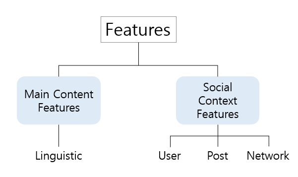

# Fake News
가짜 뉴스

## 1. Introduction
* 한국언론진흥재단: 정치, 경제적 이익을 위해 의도적으로 언론보도의 형식을 하고 유포된 거짓 정보
  1. 허위정보(dis-information): 의도적으로 만들어진 허위정보 또는 오해를 부르는 정보. 대상을 속이기 위해 숙고해서 계산된 방식으로 퍼뜨리는 정보
  2. 거짓정보(hoax): 진실을 가장해서 고의로 조작한 정보. 관찰이나 판단오류, 선의의 거짓말, 전설, 만우절 농담과 구별
  3. 오인정보(mis-information): 사실이 아님을 인지하지 못한 채 의도적 또는 비의도적으로 전파되는 정보
  4. 패러디(parodies)/풍자적: 대상이 허구임을 인지할 수 있는 상태로 허위적 정보 구성
  5. 루머/유언비어(rumor): 근거 없이 퍼지는 소문 등으로 정보의 불확실성이 주요 원인 중 하나
* **특정 커뮤니티나 유사 언론 사이트를 숙주 삼아 생산**되고, 소셜미디어를 통해 확산되는 전형적인 메커니즘  
  ```
  [ Eco-Chamber ]
  닫힌 시스템 안에서 어떤 정보나 아이디어, 신념들이 교환 될수록 증폭되고 강화되며,
  그와 다르거나 반하는 시각들은 검열되거나 불허 혹은 축소 반영되는 상황
  ```
  #### 인터넷 서비스 중 가짜뉴스를 받아본 경로 (%)
  |카카오톡, 라인 등 모바일 메신저|39.7|
  |:--:|:--:|
  |페이스북, 트위터 등 소셜플랫폼|27.7|
  |인터넷 카페/커뮤니티, 블로그|24.3|
  |유튜브, 아프리카 TV 등|4.6|
  |가짜 뉴스 사이트|3.7|
  
## 2. Data Preprocessing

#### Linguistic-based Feature  
Fake News일수록 객관적인 주장보다 정치/경제관련 글과 독선적이고 선정적인 단어가 포함되는 경향이 있음.<br>따라서 언어적 특징을 이용한 Fake News를 찾아내는 것이 타당함
```
Since fake news pieces are intentionally created for financial or political gain rather than to report objective claims,
  they often contain opinionated and inflammatory language, crafted as 'clickbait'
It is reasonable to exploit linguistic features that capture the different writing styles and sensational headlines to detect fake.
```

## Reference
* paper: https://arxiv.org/pdf/1708.01967.pdf
